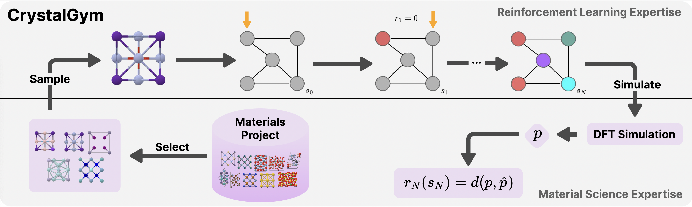

# CrystalGym - A New Benchmark for Materials Discovery Using Reinforcement Learning

A Gymnasium environment for generating crystalline materials based on DFT rewards. 




## Installation of CrystalGym

Installation of `conda` environment (deactivate all existing environments before creating a new environment)

`conda create --name crystalgym python=3.10`

### Installing requirements

- `cd crystal-gym`

- `pip install -r requirements.txt`

- `pip install -e .`

Extract Psedopotentials

- `cd crystal_gym/files`

- `tar -xvf SSSP.tar.gz` 

## Installation of Quantum Espresso (with CUDA support)

To install Quantum Espresso (QE) with CUDA support, you would need

1. Access to V100/RTX/A100/H100 (not exhaustive) GPU

2. Nvidia High Performance Computing (NVHPC) SDK is necessary. If you do not have it pre-installed in your system, please follow the instructions provided in their [offlicial website](https://docs.nvidia.com/hpc-sdk/). The version that we used is 23.7, but the later versions would also work. 

3. CUDA 12.* (we use v 12.2)

4. OpenMPI and OpenMP support

Steps to install QE

1. Download Quantum Espresso (v 7.3.1 or a version of your choice) from https://www.quantum-espresso.org/download-page/ after registering with your details. 
2. Extract the downloaded file: `tar -xvf qe-7.3.1-ReleasePack.tar.gz`
3. `cd qe-7.3.1`
4. `module purge`
5. `module load cuda/12.2`
6. `module load nvhpc/23.7`
7. `export NVHPC_CUDA_HOME="$CUDA_HOME"`
8. `./configure --prefix=/path/to/qe-7.3.1 --enable-openmp --enable-parallel --with-cuda="$NVHPC_CUDA_HOME" --with-cuda-runtime=12.2 --with-cuda-cc=80 --with-cuda-mpi=yes`
9. Note: In step 8, . 
    - `--with-cuda-cc=80` for A100 GPU
    - `--with-cuda-cc=70` for V100/RTX GPU
    - `--with-cuda-cc=89` for L40 GPU
    - `--with-cuda-cc=90` for H100 GPU
10. `make -j8 pw`
11. `make install`

If you do not face any errors while doing the above steps, your compilation is successful. 

## Testing Quantum Espresso
In the `crystal_gym/samples` folder we provide some sample QE input files (`.pwi`), which you can use for testing if the installation is successful. 
1. cd `crystal_gym/samples`
2. In `espresso_<id>.pwi`, change `pseudo_dir` in `&CONTROL` to the absolute path of the `crystal_gym/files/SSSP` folder. 
3. `mpirun --bind-to none  -np 1 /path/to/qe-7.3.1/bin/pw.x -in espresso_<id>.pwi > espresso_<id>.pwo`
4. If the above command fails, try without `--bind-to none`
5. If Step 3. succeeds you should be able to see the output of the simulation in `espresso_<id>.pwo`

## The CrystalGym Environment. 

The CrystalGym environment class is defined in `crystal_gym/env/crystal_env.py`. To load the environment

```
import gymnasium as gym
from crystal_gym.env import CrystalGymEnv
import yaml
import yaml
import random

with open('config/qe/qe.yaml', 'r') as file:
    qe_args = yaml.safe_load(file)

with open('config/env/env.yaml', 'r') as file:
    env_args = yaml.safe_load(file)

env_args['run_name'] = 'sample'
kwargs = {
    'env': env_args, 
    'qe': qe_args, 
}

env = gym.make("CrystalGymEnv-v0", kwargs = kwargs)

intitial_state, info = env.reset()
actions = [random.randint(0, 10) for _ in range(env.n_sites)]

for action in actions:
    state, reward, terminated, truncated, info = env.step(action)
print("Reward: ", reward)
print("Info: ", info)
```

For further details about the arguments that have to be modified for each of the CrystalGym tasks we performed, and QE parameters, please check `env.yaml` and `qe.yaml` in the `crystal_gym/config` folder.  

## Training RL algorithm. 
In the example below, we show how to train the DQN algorithm, for the single crystal case, optimizing for the bulk modulus. 

```
python dqn.py exp.exp_name="bm-single" \ 
              env.index=3403 # C1 crystal - choose another index for different crystal \ 
              env.property="bm" \ 
              env.p_hat=300.0 \
              qe.occupations="smearing" \ 
              qe.calculation="scf" \ 
              env.mode="single" # for single crystal optimization \
```

For density, 

```
python dqn.py exp.exp_name="density-single" \ 
              env.index=3403 # C1 crystal - choose another index for different crystal \ 
              env.property="density" \ 
              env.p_hat=3.0 \
              qe.occupations="smearing" \ 
              qe.calculation="vc-relax" \ 
              env.mode="single" # for single crystal optimization \
```
For band gap, 

```
python dqn.py exp.exp_name="band_gap-single" \ 
              env.index=3403 # C1 crystal - choose another index for different crystal \ 
              env.property="band_gap" \ 
              env.p_hat=1.12 \
              qe.occupations="fixed" \ 
              qe.calculation="scf" \ 
              env.mode="single" # for single crystal optimization \
```

Note the difference in the QE arguments for each property. `env.index` is the index of the crystals in the validation set of MP-20. 

For mixed crystals

```
python dqn.py exp.exp_name="density-mixed" \ 
              env.index="blank" # arbitrary name for mixed crystals \ 
              env.property="density" \ 
              env.p_hat=3.0 \
              qe.occupations="smearing" \ 
              qe.calculation="vc-relax" \ 
              env.mode="cubic_mini" # for single crystal optimization \
```

Please refer to the respective config files of Rainbow, PPO, and SAC for knowing about the algorithm-specific hyperparameters. 

## Acknowledgements
1. CDVAE (https://github.com/txie-93/cdvae) for data and multi-graph representation
2. CleanRL (https://github.com/vwxyzjn/cleanrl) for the codes for PPO, Rainbow, SAC, and DQN
3. MEGNet (http://github.com/materialsvirtuallab/matgl)
4. PyMatGen (https://github.com/materialsproject/pymatgen)
5. ASE (https://wiki.fysik.dtu.dk/ase/)


## License
Code repository is licensed under the permissive MIT license.