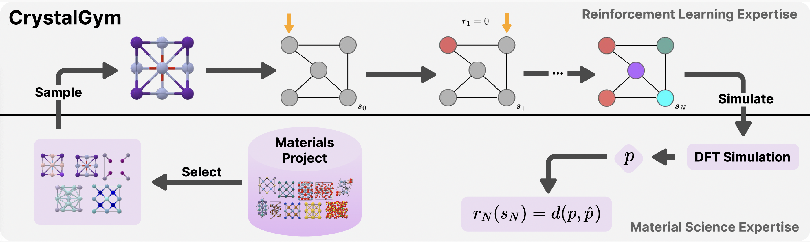

# CrystalGym 🧊

[](https://www.python.org/downloads/release/python-3110/)
[](https://opensource.org/licenses/MIT)
[](https://gymnasium.farama.org/)

> **A Gymnasium environment for generating crystalline materials using reinforcement learning with DFT-based rewards**



## 📋 Table of Contents

- [Overview](#overview)
- [Features](#features)
- [Installation](#installation)
  - [Environment Setup](#environment-setup)
  - [Dependencies](#dependencies)
  - [Pseudopotentials](#pseudopotentials)
- [Quantum Espresso Setup](#quantum-espresso-setup)
- [Quick Start](#quick-start)
- [Training Examples](#training-examples)
- [Documentation](#documentation)
- [To Do](#-to-do)
- [Acknowledgements](#acknowledgements)
- [License](#license)

## 🎯 Overview

CrystalGym is a comprehensive reinforcement learning environment designed for materials discovery. It provides a standardized interface for training RL agents to generate crystalline materials with desired properties using density functional theory (DFT) calculations as rewards.

## ✨ Features

- 🏗️ **Gymnasium-compatible environment** for RL training
- ⚛️ **DFT-based rewards** using Quantum Espresso
- 🧪 **Multiple crystal optimization modes** (single, mixed)
- 📊 **Various material properties** (bulk modulus, density, band gap)
- 🔧 **Easy configuration** via YAML files
- 🚀 **Multiple RL algorithms** (DQN, PPO, SAC, Rainbow)

## 🚀 Installation

### Environment Setup

Create a new conda environment (deactivate any existing environments first):

```bash
conda create --name crystalgym python=3.11
conda activate crystalgym
```

### Dependencies

Navigate to the project directory and install the dependencies:

```bash
cd crystal-gym
pip install -r requirements.txt
pip install -e .
```

### Pseudopotentials

Download and extract the Standard Solid-State Pseudopotentials (SSSP v1.3.0):

```bash
cd crystal_gym/files
# Download SSSP_1.3.0_PBE_efficiency.tar.gz from: https://www.materialscloud.org/discover/sssp
wget https://archive.materialscloud.org/api/records/rcyfm-68h65/files/SSSP_1.3.0_PBE_efficiency.tar.gz/content -O SSSP_1.3.0_PBE_efficiency.tar.gz
mkdir SSSP
tar -xvf SSSP_1.3.0_PBE_efficiency.tar.gz -C SSSP
``` 

## ⚛️ Quantum Espresso Setup

### Prerequisites

Before installing Quantum Espresso with CUDA support, ensure you have:

- **GPU Access**: V100, RTX, A100, H100, or compatible GPU
- **NVIDIA HPC SDK**: Version 23.7+ (see [official documentation](https://docs.nvidia.com/hpc-sdk/))
- **CUDA**: Version 12.2 or compatible
- **OpenMPI & OpenMP**: For parallel processing support

### Installation Steps

1. **Download and Extract Quantum Espresso**
   ```bash
   # Register and download from: https://www.quantum-espresso.org/download-page/
   tar -xvf qe-7.3.1-ReleasePack.tar.gz
   cd qe-7.3.1
   ```

2. **Load Required Modules**
   ```bash
   module purge
   module load cuda/12.2
   module load nvhpc/23.7
   export NVHPC_CUDA_HOME="$CUDA_HOME"
   ```

3. **Configure Quantum Espresso**
   ```bash
   ./configure --prefix=/path/to/qe-7.3.1 \
               --enable-openmp \
               --enable-parallel \
               --with-cuda="$NVHPC_CUDA_HOME" \
               --with-cuda-runtime=12.2 \
               --with-cuda-cc=80 \
               --with-cuda-mpi=yes
   ```

4. **Compile and Install**
   ```bash
   make -j8 pw
   make install
   ```

   > **Note**: Choose the appropriate `--with-cuda-cc` flag for your GPU:
   > - `80` for A100 GPU
   > - `70` for V100/RTX GPU  
   > - `89` for L40 GPU
   > - `90` for H100 GPU

5. **Verify Installation**
   ```bash
   # Test the installation
   /path/to/qe-7.3.1/bin/pw.x --version
   ``` 

### Testing Quantum Espresso

Test your QE installation using the provided sample files:

```bash
cd crystal_gym/samples

# Update the pseudopotential directory path in the input file
# Edit espresso_<id>.pwi and change pseudo_dir to your absolute files/SSSP folder path 

# Run a test calculation
mpirun --bind-to none -np 1 /path/to/qe-7.3.1/bin/pw.x \
       -in espresso_<id>.pwi > espresso_<id>.pwo

# If the above fails, try without --bind-to none
mpirun -np 1 /path/to/qe-7.3.1/bin/pw.x \
       -in espresso_<id>.pwi > espresso_<id>.pwo
```

Check the output file `espresso_<id>.pwo` to verify successful execution.

## 🚀 Quick Start

### Basic Usage

First, load the required CUDA and NVHPC modules (as mentioned in [Quantum Espresso Setup](#quantum-espresso-setup)) and optionally enable OpenMP threading. 

```bash
module load cuda/12.2
module load nvhpc/23.7
export OMP_NUM_THREADS=2
```

Next, modify the appropriate paths in `config/qe/qe.yaml` (QE, SSSP, and pseudodict.pkl) and `config/env/env.yaml` (data). Alternatively, you can pass them as arguments. 

The CrystalGym environment is defined in `crystal_gym/env/crystal_env.py`. Here's how to get started:


```python
import gymnasium as gym
from crystal_gym.env import CrystalGymEnv
import yaml
import random

# Load configuration files
with open('path/to/config/qe/qe.yaml', 'r') as file:
    qe_args = yaml.safe_load(file)

with open('path/to/config/env/env.yaml', 'r') as file:
    env_args = yaml.safe_load(file)

# Configure environment
env_args['run_name'] = 'sample'
kwargs = {
    'env': env_args, 
    'qe': qe_args, 
}

# Create and initialize environment
env = gym.make("CrystalGymEnv-v0", kwargs=kwargs)
initial_state, info = env.reset()

# Run a simple episode
terminated = truncated = False
while not terminated and not truncated:
    action = env.action_space.sample()
    state, reward, terminated, truncated, info = env.step(action)

# Print outputs
error_flag = info["error_flag"]

if error_flag:
    print("DFT error!")
else:
    print("DFT success!")
    
print(f"Final Reward: {reward}")
print(f"Property Value: {info['final_info'][0]['episode']['prop']}")
print(f"Simulation Time: {info['final_info'][0]['episode']['sim_time']} seconds")
```

### Configuration

For detailed configuration options, refer to the YAML files in `crystal_gym/config/`:
- `env.yaml` - Environment parameters
- `qe.yaml` - Quantum Espresso settings  

## 🎯 Training Examples

### Single Crystal Optimization

#### Bulk Modulus Optimization
```bash
python dqn.py exp.exp_name="bm-single" \
            env.index=3403 \
            env.property="bm" \
            env.p_hat=300.0 \
            qe.occupations="smearing" \
            qe.calculation="scf" \
            env.mode="single" \
            env.data_path="../data/mp_20/val.csv" \
            qe.pseudo_dir="absolute/path/to/files/SSSP" \
            qe.pseudodict="../files/pseudodict.pkl"\
            qe.qe_dir="path/to/qe-7.3.1"
```

#### Density Optimization
```bash
python dqn.py exp.exp_name="density-single" \
            env.index=3403 \
            env.property="density" \
            env.p_hat=3.0 \
            qe.occupations="smearing" \
            qe.calculation="vc-relax" \
            env.mode="single" \
            env.data_path="../data/mp_20/val.csv" \
            qe.pseudo_dir="absolute/path/to/files/SSSP" \
            qe.pseudodict="../files/pseudodict.pkl"\
            qe.qe_dir="path/to/qe-7.3.1"
```

#### Band Gap Optimization
```bash
python dqn.py exp.exp_name="band_gap-single" \
            env.index=3403 \
            env.property="band_gap" \
            env.p_hat=1.12 \
            qe.occupations="fixed" \
            qe.calculation="scf" \
            env.mode="single" \
            env.data_path="../data/mp_20/val.csv" \
            qe.pseudo_dir="absolute/path/to/files/SSSP" \
            qe.pseudodict="../files/pseudodict.pkl"\
            qe.qe_dir="path/to/qe-7.3.1"
```

### Mixed Crystal Optimization

```bash
python dqn.py exp.exp_name="density-mixed" \
            env.index="blank" \
            env.property="density" \
            env.p_hat=3.0 \
            qe.occupations="smearing" \
            qe.calculation="vc-relax" \
            env.mode="cubic_mini" \
            env.data_path="../data/mp_20/val.csv" \
            qe.pseudo_dir="absolute/path/to/files/SSSP" \
            qe.pseudodict="../files/pseudodict.pkl"\
            qe.qe_dir="path/to/qe-7.3.1"
```

### Algorithm-Specific Training

For other RL algorithms (Rainbow, PPO, SAC), refer to their respective configuration files for algorithm-specific hyperparameters.

> **Note**: 
> - `env.index` refers to crystal indices from the MP-20 validation set
> - Different properties require different QE calculation types and occupation settings
> - Use `env.mode="single"` for single crystal optimization and `env.mode="cubic_mini"` for mixed crystals 

## 📋 To Do

- ☐ Prevent warnings 
- ☐ Support for other MLIPs (e.g. MACE, M3GNet, etc.)
- ☐ Optimize `env.reset` method for improved speed

## 🙏 Acknowledgements

We gratefully acknowledge the following open-source projects and resources:

| Project | Purpose | Link |
|---------|---------|------|
| **CDVAE** | Data and multi-graph representation | [GitHub](https://github.com/txie-93/cdvae) |
| **CleanRL** | RL algorithm implementations (PPO, Rainbow, SAC, DQN) | [GitHub](https://github.com/vwxyzjn/cleanrl) |
| **MEGNet** | Materials property prediction | [GitHub](http://github.com/materialsvirtuallab/matgl) |
| **PyMatGen** | Materials analysis toolkit | [GitHub](https://github.com/materialsproject/pymatgen) |
| **ASE** | Atomic simulation environment | [Website](https://wiki.fysik.dtu.dk/ase/) |
| **SSSP** | Standard solid-state pseudopotentials | [Materials Cloud](https://www.materialscloud.org/discover/sssp) |

## 📄 License

This project is licensed under the **MIT License** - see the [LICENSE](LICENSE) file for details.

---

<div align="center">

**CrystalGym** - Accelerating materials discovery through reinforcement learning

[Report Bug](https://github.com/chandar-lab/crystal-gym/issues) • [Request Feature](https://github.com/chandar-lab/crystal-gym/issues) • [Documentation](https://github.com/chandar-lab/crystal-gym/wiki)

</div>